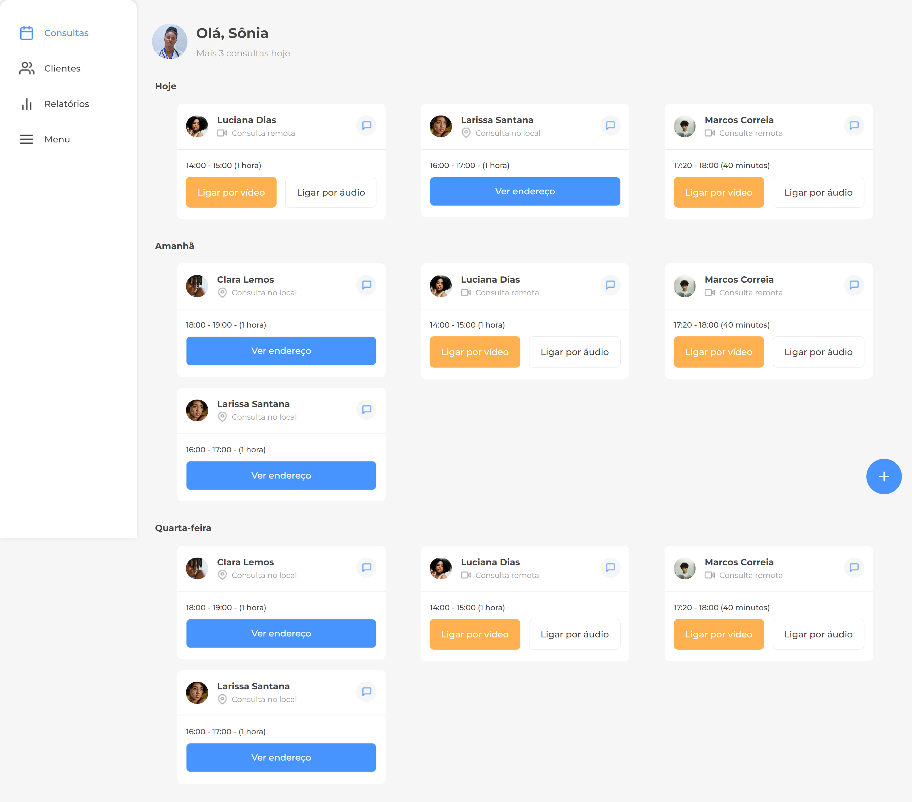

<h1 align="center">Projeto - 7DaysOfCode - Responsividade</h1>

 Desenvolvido no Desafio 7 Days Of Code de Responsividade da plataforma de estudos Alura. Durante 7 dias pratiquei o meu conhecimento de HTML e CSS para desenvolver uma página através de um layout no Figma. Utilizei conceitos como Mobile First, media queries, unidades relativas e medidas responsivas em CSS. 

 
 

  

    <h3>Página completa</h3> 
    

 

## 🚀 Tecnologias
* HTML e CSS
* Display grid
* Media queries
* Flexbox
 

## 💻 Projeto
Para visualizar a última vesão do projeto clique abaixo:
 
 
Visite o [projeto](https://7daysofcode-responsividade-seven.vercel.app/) online.
 
 

## 🧠 Desafio
Todos os dias os desafios foram enviados, sendo eles:

- [x] DIA 1
> Já no primeiro dia, você vai ser apresentado com o layout de uma página no Figma, analisá-lo e usá-lo para criar o cabeçalho da sua aplicação, usando o conceito de Mobile First.

- [x] DIA 2
> Aqui, você continuará o desenvolvimento a partir do que você fez no primeiro dia, e implementará o rodapé e o botão flutuante da aplicação. Além disso, você terá um Desafio Extra mais complexo, caso queira resolvê-lo.

- [x] DIA 3
> Nesse dia o foco vai ser em CSS. Na aplicação que você desenvolveu até agora, o tamanho das fontes e outros elementos provavelmente está fixo para qualquer dispositivo, o que pode causar problemas em telas maiores. A sua tarefa será começar a ajustar a aplicação para usar unidades de medida relativas.

- [x] DIA 4
> Chegou a hora de usar media queries! A sua tarefa nesse dia será reorganizar a lista de consultas da aplicação para que a mesma seja exibida em uma, duas ou três colunas, dependendo do tamanho da tela do usuário.

- [x] DIA 5
> Nesse dia você irá alterar o CSS, a fim de transformar os itens que estavam no rodapé da versão Mobile em um formato de 'menu lateral' sempre que o site for acessado em dispositivos com telas maiores.

- [x] DIA 6
> Continuando as adaptações para telas maiores, nesse dia você deverá trocar o paradigma de 'botão flutuante' para algo mais apropriado a telas de tablet e desktop, como um formulário.

- [x] DIA 7
> No sétimo e último dia do desafio, você irá tornar a sua aplicação disponível de forma pública na internet. A sua tarefa será hospedar a sua página na nuvem, para que outras pessoas possam acessá-la e ela se torne acessível como um portfólio. Você irá fechar com chave de ouro!

### Conclusão:
Foi possível colocar em prática os conceitos que aprendi durante os cursos da Formação da Alura "[A partir do Zero: HTML e CSS para Projetos Web](https://cursos.alura.com.br/degree/certificate/2e85c664-e5e4-450f-9994-074e43c763e0?lang=pt_BR)" e consequentemente fixar ainda mais o aprendizado, além de aprender ainda mais!

 

---

Feito com muito ♥

Obrigado por visitar meu Github ♥
Me dê um "FOLLOW" que retribuo, vamos criar novas conexões 😊

Até a próxima! 👋😊

